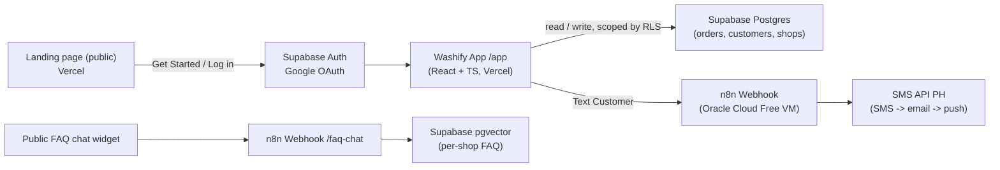
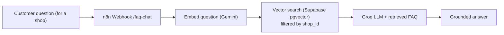

# 🫧 Washify — Multi-Shop Laundry SaaS (Portfolio Plan)

> A portfolio project built to showcase **full-stack + automation** skills for an **AI / Automation Specialist** role. **Washify** is a lightweight, SaaS-style laundry manager: any shop owner signs in with Google, gets their own private workspace, and manages orders, notifies customers when laundry is done (via an **n8n** automation), and tracks sales with one-click **Excel export**.
>
> It's **free to run** (free tiers only) — the "SaaS" here means **multi-tenant architecture**, not paid subscriptions. There's no billing; it's a demo that *could* become a real product.

---

## 📌 What changed from v1 (single shop → multi-shop)

| | v1 (Happy Wash) | **v2 (Washify)** |
|---|---|---|
| Who uses it | One shop, two operators | **Many shop owners**, each isolated |
| Sign-in | Shared PIN on one device | **Google OAuth** (real accounts) |
| Database | Google Sheet + Apps Script bridge | **Supabase Postgres** (real DB + RLS) |
| Entry point | Straight into the app | **Public landing page** + Log in / Get Started |
| Data isolation | N/A | **Row Level Security** per shop |

---

## 🧩 What "multi-tenant" means here

Every signed-in owner gets their **own shop workspace**. They can only ever see and edit **their** orders, customers, and FAQ — never anyone else's. This is enforced at the database level with **Row Level Security (RLS)**, so isolation doesn't depend on the frontend behaving.

- One **Google account** → one **owner profile** → one **shop** (v1 keeps it to a single shop per account; multiple shops per account is a future tweak).
- All data rows carry a `shop_id`. RLS policies say: *you may only touch rows where `shop_id = auth.uid()`.*
- The result behaves like a real SaaS (Stripe-style "sign up and you have your own space") without any payment.

---

## 🧰 Tech stack

| Layer | Technology |
|---|---|
| Frontend | **React + TypeScript** (Vite), HTML, CSS |
| Styling | **Tailwind CSS** using the brand palette below |
| Auth | **Supabase Auth** with **Google OAuth** |
| Database | **Supabase Postgres** (with **Row Level Security**) |
| Vector store | **Supabase pgvector** (same project) |
| Automation | **n8n** (self-hosted in Docker) |
| Notifications | **SMS API PH** (free Philippine SMS gateway, SMS → email → push fallback) |
| Hosting (app) | **Vercel** (auto-deploy from a public GitHub repo) |
| Hosting (n8n) | **Oracle Cloud Always Free** VM for the public demo · local Docker for dev |
| AI model (chatbot) | **Groq** LLM (free, fast) |
| Embeddings | **Google Gemini** `text-embedding-004` (free tier) |

> **Note:** Supabase now replaces the old Google Sheet + Apps Script bridge. One Supabase project gives us **Auth + relational database + vector store** in a single free backend.

---

## 💾 Supabase free tier — how far does it go?

| Resource | Free limit | What it means for Washify |
|---|---|---|
| **Database size** | **500 MB** | ~**half a million** laundry orders across all shops. Non-issue for a demo. |
| **File storage** | **1 GB** | Logos / receipt PDFs only — barely used. |
| **Egress / bandwidth** | **5 GB / month** | The *real* first limit. Fine for demo traffic; watch dashboards that refetch a lot. |
| **Monthly active users** | **50,000 MAU** | Way more than a portfolio demo needs. Google OAuth included. |
| **API requests** | Unlimited | — |
| **Active projects** | **2 max** | One project is plenty here. |
| **Inactivity** | **Paused after 7 days** | Avoid with a tiny daily keep-alive ping (e.g. a free GitHub Action or n8n cron). |

**Bottom line:** storage is not the constraint — a laundry order is just a few hundred bytes. You'd hit the **5 GB monthly bandwidth** or the **7-day auto-pause** long before the 500 MB database fills.

---

## 🏗️ Architecture



**Why this shape:**

- The **landing page** is public and sells the product; everything real lives behind **Google sign-in**.
- The app talks **directly to Supabase** using the signed-in user's token. **RLS** guarantees each shop only sees its own rows — no custom backend needed.
- The **Text Customer** button calls an **n8n webhook** that sends the SMS. Keeping automation in n8n is the core "automation specialist" showpiece.

---

## 🖥️ Landing page

A single public marketing page — the first thing an interviewer sees.

**Top navigation (sticky):**
- **Left:** Washify logo (aqua bubble mark + wordmark).
- **Right:** **Log in** (text button) and **Get Started** (filled aqua button). Both trigger **Google OAuth**; new users are auto-provisioned a shop on first sign-in.

**Sections:**
1. **Hero** — headline ("Run your laundry shop, the smart way"), short subtext, **Get Started with Google** button, and a product screenshot/mockup.
2. **Features** — 3–4 cards: order tracking, customer SMS notifications, sales + Excel export, FAQ chatbot.
3. **How it works** — 3 steps: *Sign in with Google → Add orders → Text customers when done*.
4. **Footer** — "Built as a portfolio project", GitHub link, tech badges.

> Same **Fresh & Clean** palette as before, so the landing page and app feel like one product.

---

## 🔐 Authentication (Google OAuth)

- **Provider:** Supabase Auth with the **Google** social provider enabled (free, included in the 50k MAU).
- **Flow:** Landing page → *Get Started / Log in* → Google consent → redirect back → Supabase session stored → app routes to `/app`.
- **First-time provisioning:** on first sign-in, a database trigger (or app-side upsert) creates the owner's **shop profile** row keyed to their `auth.uid()`.
- **Route protection:** `/app/*` is gated — no session means redirect to the landing page.
- **Isolation:** all data access goes through **RLS**, so even a leaked/forged client request can't read another shop's data.
- **Future:** add roles (owner vs staff), email/password as a fallback, and "invite a staff member" to a shop.

---

## 🗃️ Data model (Supabase Postgres)

### `shops` (one per owner)
| Column | Type | Notes |
|---|---|---|
| id | uuid (PK) | equals `auth.uid()` of the owner |
| shop_name | text | e.g. "Happy Wash" |
| owner_name | text | display name |
| price_per_load | numeric | default `220` |
| max_kg | int | default `8` |
| created_at | timestamptz | default now() |

### `orders`
| Column | Type | Notes |
|---|---|---|
| id | uuid (PK) | |
| shop_id | uuid (FK → shops.id) | tenant key |
| order_code | text | e.g. `WSH-0001` (per shop) |
| customer_name | text | |
| phone | text | stored as typed; normalized to E.164 when texting |
| num_loads | int | staff enters this |
| amount_due | numeric | = num_loads × price_per_load |
| dropoff_date | date | defaults to today |
| status | text | Received / Washing / Ready / Picked up |
| paid | bool | default false |
| texted_at | timestamptz | set when notified |
| logged_by | text | optional operator tag |
| created_at | timestamptz | default now() |

### `customers` (directory, auto-fill on repeat visits)
| Column | Type | Notes |
|---|---|---|
| id | uuid (PK) | |
| shop_id | uuid (FK) | tenant key |
| name | text | |
| phone | text | |
| visit_count | int | |
| last_visit | date | |

### `faq_documents` (per-shop RAG knowledge base)
| Column | Type | Notes |
|---|---|---|
| id | uuid (PK) | |
| shop_id | uuid (FK) | tenant key (also stored in metadata for vector filtering) |
| content | text | FAQ chunk |
| metadata | jsonb | `{ "shop_id": "…" }` |
| embedding | vector(768) | Gemini `text-embedding-004` |

> **RLS on every table:** policies restrict `select / insert / update / delete` to rows where `shop_id = auth.uid()`. This is the single most important multi-tenant safeguard — and a great thing to explain in the interview.

---

## ✨ Features

### Core
- 🔑 **Sign in with Google** — each owner gets an isolated shop.
- ➕ **Add laundry order** — name, phone, number of loads; amount auto-calculated (`loads × price_per_load`).
- 📋 **Order list** — all active orders for *your* shop at a glance.
- 📱 **Text Customer button** — opens an editable message box (pre-filled `Hi {Customer Name}. Your laundry is done.`, **160-character** limit) and sends the SMS via n8n.
- 💰 **Sales views** — totals by **day / week / month**.
- 📤 **Excel export** — one click to download the current day/week/month view as `.xlsx`.

### Selected extras
- 🔁 **Status pipeline** — `Received → Washing → Ready → Picked up`.
- 🔎 **Search & filter** — by customer name, phone, or status.
- 👥 **Customer directory** — saved customers auto-fill name + phone on repeat visits.
- ✅ **Paid / Unpaid tracking** — know who still owes money.
- 📊 **Dashboard charts** — revenue trend and loads-per-day visualizations.
- 🧾 **Printable receipt / claim stub** — printout with the Order ID for the customer.
- ⚙️ **Shop settings** — owner can edit shop name and price-per-load (since it's now multi-tenant).

---

## 🔔 Notifications & automation (the showpiece)

The **Text Customer** button opens an editable message box (pre-filled `Hi {Customer Name}. Your laundry is done.`, 160-char limit). The app swaps `{Customer Name}` for the real customer name, then posts the customer's **phone** and the final **message** to an n8n webhook, which sends a real SMS through **SMS API PH** (free). Because the message is composed entirely in the app, one shared workflow serves every shop unchanged — n8n simply relays and delivers it.

```
Webhook (POST /laundry-done)   ← receives { phone, message }
   → Build Message (use the staff's message as-is + normalize phone to E.164)
   → Send SMS (SMS API PH, x-api-key)   → auto-fallback to email/push
   → Respond to webhook (success)
```

> Full step-by-step build instructions live in **`n8n-automation-tutorial.md`** (SMS API PH endpoint, `x-api-key` auth, phone normalization, troubleshooting, and the importable workflow JSON).

### Hosting n8n

- **Dev + learning:** self-host with **Docker Desktop** (free, Windows & Mac) — visual dashboard, start/stop containers by clicking, no CLI after first setup.
- **Public demo:** run the same container on an **Oracle Cloud Always Free** VM so the webhook is always reachable for free.

```yaml
# docker-compose.yml (local dev)
services:
  n8n:
    image: docker.n8n.io/n8nio/n8n
    restart: unless-stopped
    ports:
      - "5678:5678"
    volumes:
      - n8n_data:/home/node/.n8n
volumes:
  n8n_data:
```

---

## 🤖 AI: RAG FAQ Chatbot (per shop)

A public chat widget that answers common questions (hours, pricing, services, turnaround) using **Retrieval-Augmented Generation** — grounded in **that shop's** own FAQ so it never makes up policies.

**Free RAG stack:**

- **LLM:** Groq (free tier, very fast)
- **Embeddings:** Google Gemini `text-embedding-004` (free tier)
- **Vector store:** Supabase pgvector (same project as the app DB)
- **Orchestration:** n8n (Vector Store + Q&A Chain + Groq Chat Model nodes)
- **Multi-tenant retrieval:** vector search is filtered by `shop_id` in the document metadata, so each shop's bot only sees its own FAQ.



### Keeping the chatbot separate from the app

| Concern | Laundry management | FAQ chatbot |
|---|---|---|
| Audience | Shop owner / staff | Public / customers |
| Access | Behind **Google sign-in** | Open, no login |
| Data | Orders + customers (RLS) | FAQ knowledge base only |
| Reads order data? | Yes | **No** (privacy) |
| n8n workflow | `Laundry Done` notifier | Separate `FAQ Chat` workflow |
| Webhook endpoint | `/laundry-done` | `/faq-chat` |
| UI surface | `/app` (auth-gated) | public chat widget |

**Rule of thumb:** the chatbot answers *general* questions only and never touches customer order data. A "Where's my laundry?" agent that *does* read orders would be a separate, authenticated flow.

---

## 📊 Sales dashboard & Excel export

- Toggle between **Day / Week / Month** (scoped to the signed-in shop).
- Shows: total revenue, number of loads, number of orders, plus charts (revenue trend, loads per day).
- **Export** button generates an `.xlsx` of the selected period (client-side, e.g. SheetJS) — no server needed.

---

## 🚀 Deployment

1. Code lives in a **public GitHub repo** (the portfolio artifact).
2. **Vercel** connects to the repo and auto-deploys on every push → clean `washify.vercel.app` link.
3. **Supabase** project holds Auth + database + pgvector; its URL and anon key go in Vercel environment variables. Add the Vercel domain to Supabase's allowed redirect URLs for Google OAuth.
4. **Oracle Cloud** n8n VM is deployed once; its webhook URLs are stored as config.
5. Add a tiny **keep-alive** (daily GitHub Action or n8n cron hitting Supabase) so the free project never auto-pauses.

---

## 🎨 Branding — "Fresh & Clean" palette (unchanged)

| Role | Color | Hex |
|---|---|---|
| Primary (water / clean) | Aqua / Cyan | `#06B6D4` |
| Accent (the "happy") | Sunny Yellow | `#FACC15` |
| Success (status) | Mint Green | `#34D399` |
| Background | Off-white | `#F8FAFC` |
| Surface | White | `#FFFFFF` |
| Text | Slate | `#0F172A` |
| Muted text | Slate gray | `#64748B` |

Aqua = water, cleanliness, trust; sunny yellow accents give it the upbeat, friendly feel. **Washify** wordmark in slate with an aqua bubble/droplet mark.

---

## 🛠️ Build phases

| Phase | What gets built | Owner |
|---|---|---|
| 1 | React + TS + Tailwind scaffold, brand palette, **landing page** | Me |
| 2 | **Supabase Auth (Google OAuth)** + route protection + shop provisioning | Me writes · you connect Google |
| 3 | **Supabase schema + RLS** (shops, orders, customers, faq_documents) | Me writes · you run SQL |
| 4 | Order entry + list + status pipeline + search (scoped by RLS) | Me |
| 5 | Sales dashboard + charts + Excel export | Me |
| 6 | n8n workflow (SMS API PH) + wire **Text Customer** button | Me writes · you deploy |
| 7 | RAG FAQ chatbot (per-shop, pgvector) | Me writes · you deploy |
| 8 | Deploy app to Vercel, n8n to Oracle Cloud, keep-alive | You (with my steps) |
| 9 | README, screenshots, demo recording for portfolio | Together |

---

## ✅ Who does what

- **I build:** the full React/TS app (landing + app), the Supabase schema + RLS policies, the n8n workflow export, and all setup instructions.
- **You deploy (with clear step-by-step guides):** the Supabase project + Google OAuth credentials, the Oracle Cloud n8n VM, the SMS API PH key, and the Vercel project.

---

## 🔮 Future enhancements (post-v2)

- Multiple shops per owner + staff invites / roles
- Per-shop branding (logo, colors, custom SMS sender)
- Loyalty punch card (e.g., 10th load free)
- Add-on services & pricing (detergent, fold-only, pickup & delivery)
- "Please pick up" reminder if an order is unclaimed for X days
- "Where's my laundry?" authenticated customer lookup
- Real billing (turn the SaaS into an actual paid product)
